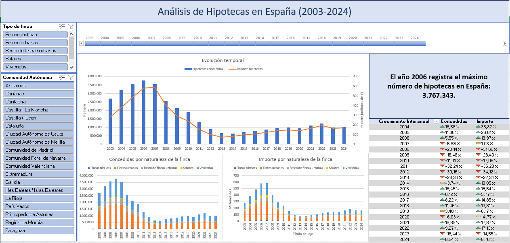

# Resumen del Proyecto: Análisis de Hipotecas en España

## Objetivo
Este proyecto tiene como objetivo analizar la evolución de las nuevas hipotecas constituidas en España, tanto en número como en importe, desde 2003 hasta 2024. El resultado final es un dashboard interactivo en Excel que permite visualizar tendencias, comparar comunidades autónomas y explorar datos por naturaleza de la finca.

## Habilidades demostradas
1. **Extracción, Transformación y Carga de datos (ETL)**
2. **Limpieza y validación de datos**
3. **Modelado de datos** (creación de relaciones entre tablas)
4. **Creación de medidas avanzadas con DAX**
5. **Desarrollo de un dashboard interactivo**

## Herramientas utilizadas
- Power Query Editor (para ETL)
- Power Pivot (para modelado de datos)
- Excel (para visualización)

## Fuente de datos
Datos públicos del Instituto Canario de Estadística sobre nuevas hipotecas constituidas según naturaleza de la finca, a nivel de comunidades autónomas y provincias (2003-2024).

[Enlace a los datos](https://datos.canarias.es/catalogos/general/dataset/nuevas-hipotecas-constituidas-segun-naturaleza-de-la-finca-comunidades-autonomas-y-provincias-p)

## Proceso detallado

### 1. Preparación de datos
- De los datos originales solamente e seleccionaron las columnas relevantes:

  - `MEDIDASHes`: Tipo de dato (número o importe de hipoteca)
  - `TIME_PERIOD#es`: Periodo temporal
  - `FINCA_NATURALEZA#es`: Naturaleza de la finca
  - `TERRITORIO#es`: Ubicación geográfica
  - `OBS_VALUE`: Valor registrado

### 2. Transformación de datos
- Se crearon tres tablas principales:
  1. **Tabla de hechos**: Datos principales de hipotecas
  
  
  
  3. **Tabla Calendario**: Para análisis temporal avanzado

  
  
  5. **Tabla Territorio**: Para organización geográfica
    
  
  

### 3. Modelado de datos
- Se establecieron relaciones entre las tablas:
  - Calendario ↔ Tabla de hechos (por fecha)
  - Territorio ↔ Tabla de hechos (por ubicación)
    
  
  

### 4. Medidas DAX
- **Medidas básicas**:
  - Total de hipotecas
  - Año máximo/mínimo
- **Medidas avanzadas**:
  - Crecimiento interanual
  - Top 3 comunidades por importe

### 5. Visualización
  
  
  
- Gráficos combinados (columnas y líneas)
- Tablas dinámicas con formato condicional
- Elementos interactivos:
  - Segmentadores (slicers) por comunidad autónoma y naturaleza de finca
  - Escala de tiempo para filtrar por años
- Elementos dinámicos:
  - Título que se actualiza automáticamente
  - Tarjetas KPI con información relevante

## Resultado final
El dashboard permite:
- Analizar tendencias temporales
- Comparar comunidades autónomas
- Explorar datos por tipo de propiedad
- Identificar años con mayor actividad hipotecaria

## Conclusión
Este proyecto demuestra habilidades completas en el proceso de análisis de datos, desde la extracción hasta la visualización, utilizando herramientas estándar del ecosistema Microsoft. El enfoque en la creación de elementos dinámicos e interactivos añade valor al resultado final.
